<!-- 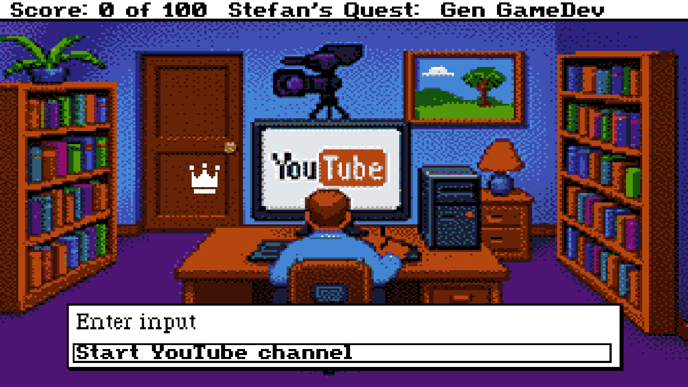{: style="width:100%"} -->

Hi, I’m Stefan, and I’m on a quest to master game dev and make my dream video game a reality!

My unique angle is that I’ll be exploring the intersection of Generative AI and Game Development, using my technical training to break down the latest research and communicate it clearly. I’ll be documenting everything and open-sourcing my code and notes so you can follow along.

<!-- more -->

Some background on myself, I have an advanced degree in Machine Learning so I can digest and think critically about the latest research. I can code pretty well too. Although, I’m a total noob to Unity, C#, Blender, and game dev concepts in general. (linear blend skinning?, particle systems?, pixel shaders?)

## My interest in video games?

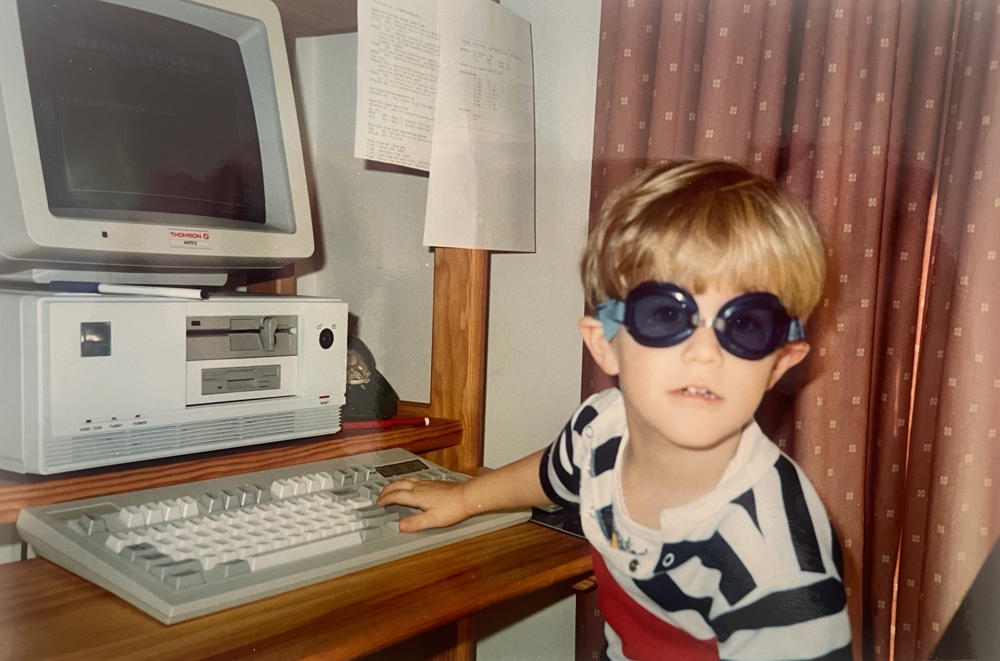{: style="width:100%"}

I've been absolutely fascinated by computers and video games since I was a young kid. I was very fortunate to grow up during the 90's, which was a pioneering time in computer and video game history.

If you were an late 80's or early 90's kid you would have seen the transition from 8-bit to 16-bit to 32- and 64-bit machines, from 16 colors to 256 to 16.7 million, from 2D to 3D games, from DOS to Windows 95, from disks (remember 5¼ floppies?) to CDs to DVDs and then the internet. Many of the games you may have played growing up in the 90s are now considered seminal and genre-defining.

## Whence game development?

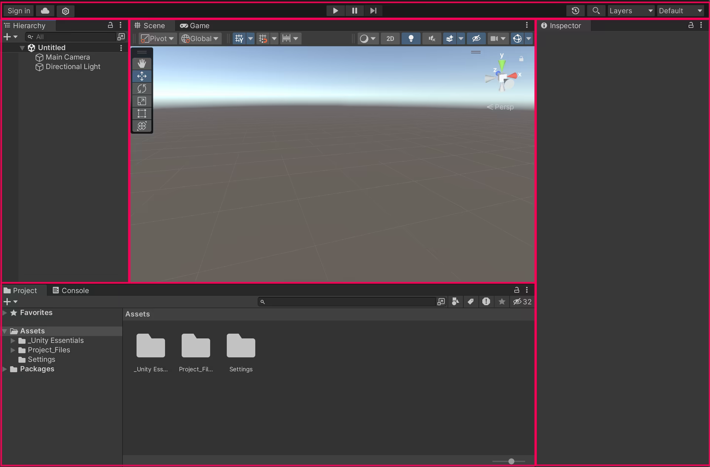{: style="width:100%"}

Last year I interviewed for a position at Unity (for a team that does ML for advertising in mobile games). It got me curious, what if I could make video games myself? I had come across YouTube tutorials before on gamedev with Unity, but always thought that it was too big a hobby to take up, especially when I had so many other interests outside of work.

I decided to take the plunge and installed Unity! It was pretty overwhelming at first, all the unfamiliar UI elements and so on… So where to start? YouTube, of course! (See the comments below for some of my favorite learning Unity channels on YouTube.) Then I took some fantastic courses from Unity’s website that I'd highly recommend. I was able to get the basics of Unity down in a few months, and it inspired me to take things further!

## The Vision

{: style="width:100%"}

A bigger goal in my life is that I want to create something of value, something different, that can inspire others to create. Rather than making just another gamedev blog, I began to think, what are my unique experiences, skills, passions I can bring to the topic.

Well, let’s see. I have a highly technical training in Machine Learning and AI research. And I'm particularly fascinated by Deep Generative Models ever since my PhD a few years back, and this was before they made a massive resurgence in 2022 with ChatGPT and Stable Diffusion.

So why not combine my two passions and produce content at the cutting edge of GenAI and gamedev? Both GameDev and GenAI are huge topics, and so the focus of this vlog will be to show what I’ve learnt and how it can be useful to other gamedevs, rather than focusing on the development of my own indie game (something that will no doubt come in time).

## Creative influences

So what are my creative influences and how will that influence the content on this vlog? Well, let me mention a selection of my favorite game genres and titles that you will be familiar with if you grew up in the 90s:

### Adventure

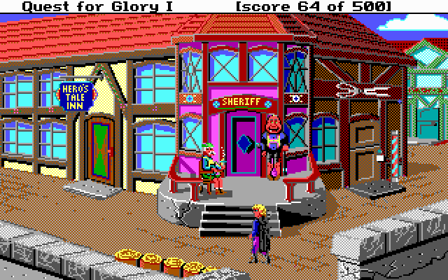{: style="width:66%"}

The adventure game genre evolved from text-based interactive "novels" from the 80s. You control a character from a third-person front-on view and solve puzzles to advance the narrative. Older graphic adventure games used a text parser to input commands while later games used a point-and-click interface.

Most adventure games are centered around the plot device of the _quest_ and borrow heavily from myth, fantasy, and science-fiction. Here's a few examples of genre-defining adventure games:

- King's Quest series
- Quest for Glory series
- Maniac Mansion

### Role-playing

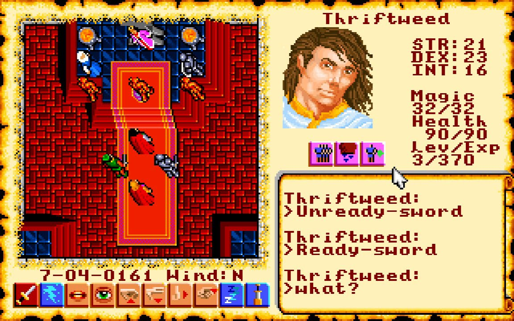{: style="width:66%"}

Role-playing games developed from the tabletop game of Dungeons and Dragons and typically involve fantasy themes, character classes and stats, and tactical combat. The Ultima series from Origin is an excellent example of early role-playing games.

Some games combine elements of other genres with role-playing. For example, the Quest for Glory series introduces role-playing elements into an adventure game, and the Zelda series introduces role-playing elements into a platformer.

- Ultima series
- Ultima Underworld

### Platformers

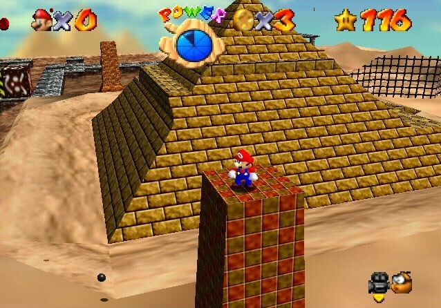{: style="width:66%"}

Platform games involve controlling a character, typically from a 3rd-person view, to run, jump, climb, swim, and in general explore the virtual world. The objectives include reaching the end location, solving puzzles, and defeating boss characters. If you grew up in the 90's you will remember all the fantastic 3D platformers on the Nintendo 64 including:

- Super Mario 64
- Banjo Kazooie
- Zelda: Ocarina of Time

## Creative "effluences"

If an influence is something that "flows into" your tastes, then an "effluence" must be something that "flows out", that is, architypes, patterns, and styles that your taste finds disagreeable.

The following are some examples of genres and titles that I played as a kid with gameplay elements I would not want to include in my own work (although they are mostly games I did actually enjoy at the time):

### Strategy

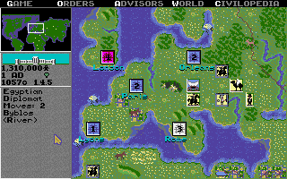{: style="width:66%"}

- Civilization
- Starcraft

### First-person shooters

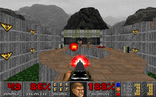{: style="width:66%"}

- Doom, Quake, etc.

### Role-playing

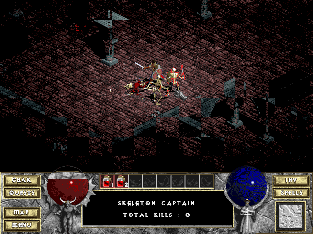{: style="width:66%"}

- Diablo series
- Final Fantasy series

### Simulation

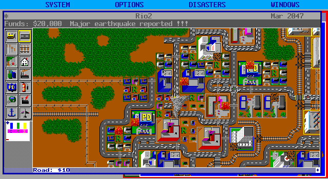{: style="width:66%"}

- SimCity
- Sports in general

## Potential influences

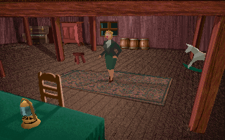{: style="width:66%"}

Despite a wasted youth playing video games, there are genre-defining games I haven't really explored in depth but am curious to do so as I think it is possible they could be creative influences for me:

- Alone in the Dark
- Myst
- Elder Scrolls
- The Sims
- Minecraft
- Fortnite

## Conclusions

Reflecting on this, I think the aspects of gameplay I would like to emulate are:

- narrative,
- characterization,
- puzzles,
- exploration,
- discovery.

And the aspects of gameplay I would like to avoid are:

- arcade-style action,
- senseless violence,
- collecting experience points / items to level up,
- totally unstructured play,
- lack of a definitive end.

_This is entirely my personal preference of course&mdash;no judgment if they're your thing!_

## What's next?

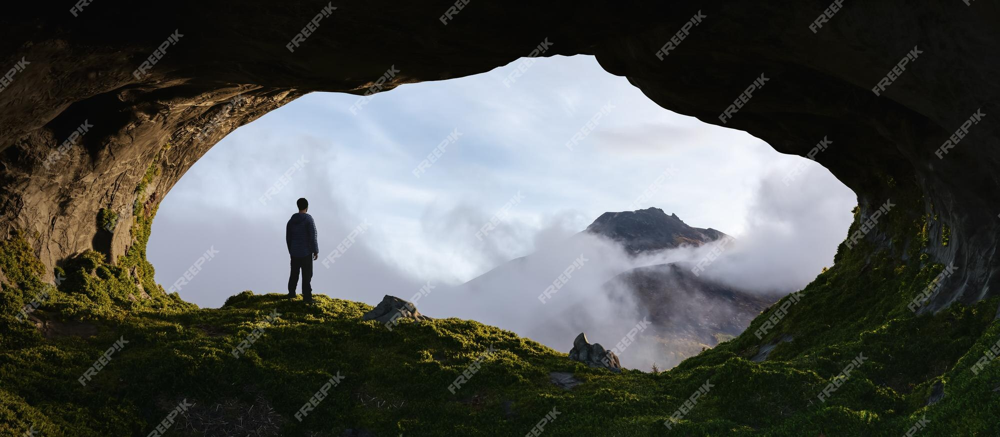{: style="width:100%"}

We’ll start our journey in the next video by asking the question, “What does Generative AI have to offer Game Development? There’s no time to waste&mdash;let’s get cracking!
