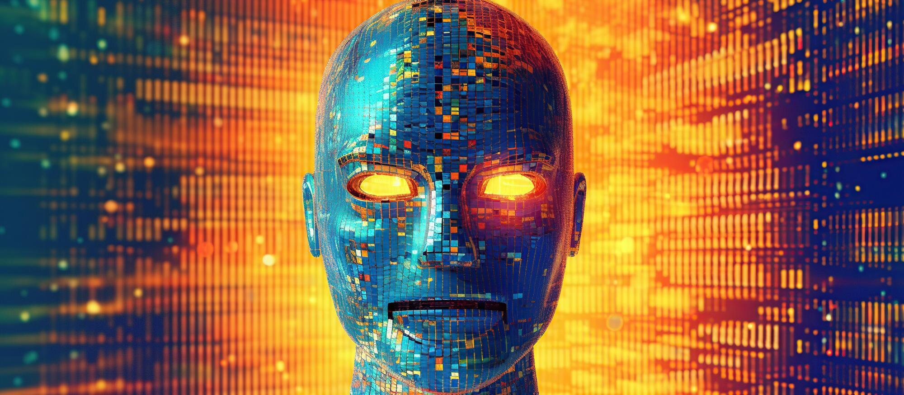

<!-- {: style="width:100%"} -->

AAA-level Game Development is inherently very expensive, presenting a very high barrier to entry in terms of skill, cost, and time. Only a few well-resources studios can make such polished games, and even those studios have reduced latitude for taking creative risks. GenAI, however, offers solutions that will allow indie developers to develop high-polished games at a fraction of the cost. Beyond lowering barriers to entry, I also believe GenAI will allow novel gameplay mechanism and advance the state of game design.

The term GenAI covers a broad spectrum of models, methods, and tooling that unlock great benefits to Game Development.

<!-- more -->

## What is Generative AI?

{: style="width:100%"}

GameDev has an obvious meaning, but what is Gen AI? I’ll start with a few words to define it.

You may be most familiar with applications of Generative AI such as ChatGPT for searching for information, Midjourney for making images, Otter.ai for taking meeting notes, and so on. But what do they all have in common?

At the heart of Generative AI is the _Deep Generative Model_. This is what we can use to generate language, in the case of ChatGPT, images in the case of Midjourney, and so on. “Deep Generative Model” is just a fancy way of saying a probability distribution that uses deep neural networks.

If you haven’t studied probability before, just think of it as a black box that takes an input, puts it through a deep neural network, and outputs a random value. The neural network controls how often the random value will be “cat” relative to how often it’s “dog”.

In the case of language models, the neural network is trained to output the next word in a sentence given the previous ones, and it turns out if you do this at a large enough scale magical things happen! The model can be refined with further training to be a chat bot, an intelligent summarizer or editor, or any of a number of other natural language applications.

## So what does Gen AI offer GameDev?

But what does Gen AI have to offer for game development and gameplay? I can see at least two different avenues of application.

### Asset generation

The most obvious way that Gen AI can be applied to GameDev is to generate game assets. I use "asset" in a broad sense here to include not only 3D models, textures, sound effects, etc. but also source code, animations, dialogue, and any other "stuff" that makes up a game.

### Intelligent agents

## Discussion

[In a future video, I'll give examples of how GenAI has already been applied to game development.]
