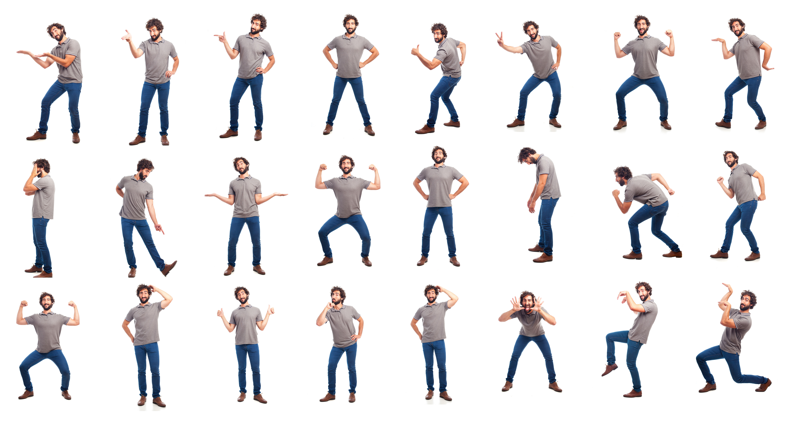
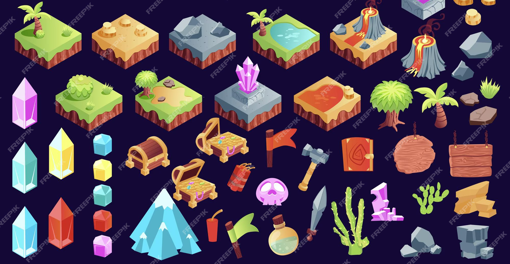
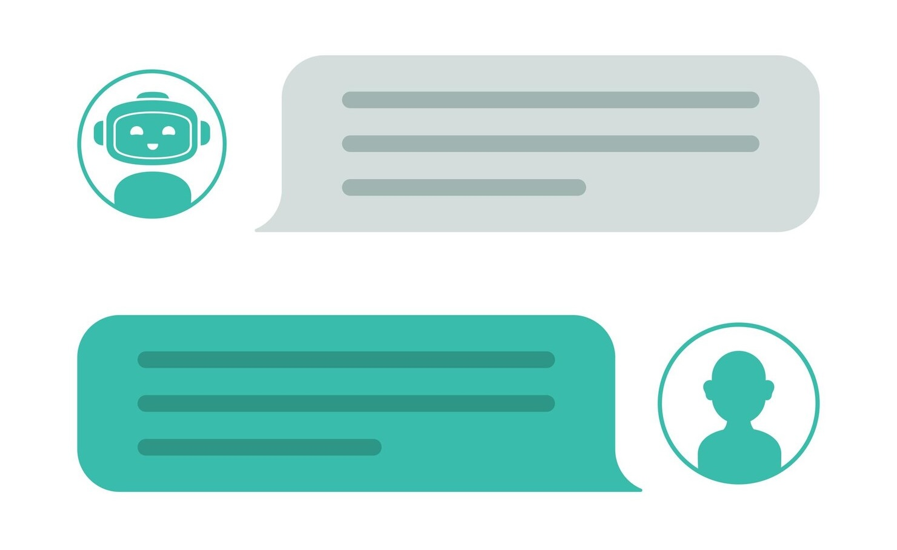

I have three ambitious goals for this year:

:octicons-goal-16: _Synthesize human motion in real-time to animate and control a character._

:octicons-goal-16: _Generate assets with state-of-the-art foundation models._

:octicons-goal-16: _Develop an intelligent agent for interacting with the game world._

It's going to be an exciting journey deepening my knowledge and experience with Unity and staying abreast of the latest developments in Generative AI. Allow me to elaborate.

<!-- more -->

## Synthesizing human motion

{: style="width:100%"}

In my view, one of the biggest determinants of game quality is the quality of the animation, especially animation of human characters. Human animation can fall into the "uncanny valley" if we aren't careful.

High-quality human animation is accessible to AAA game studios who have the resources to collect, filter, and wrangle large amounts of motion-capture (mocap) data from human actors. What about the rest of us, however? GenAI offers some solutions.

GenAI is very capable of learning to synthesize human motion. There are models that can complete animations given intermediate keyframes ("in-betweening"), take into account the geometry of physical obstacles, and generate motion given a text descriptions of the action to be performed.

There is a rich literature of models, datasets, and impressive results modeling human animation for diverse tasks making use of recent advances in transformer architectures and denoising diffusion generative models, especially from 2020 onwards. I'll be maintaining an organized bibliography on the [references page](../references.md) and deep dive into this research in the upcoming posts.

## Generating other assets

{: style="width:100%"}

Another large determinant of game quality or "polishedness" is the artfulness of the models, environments, visual effects, sound effects, and so on. AAA game studios can afford to hire the top talent to produce such assets, but again what is the indie game developer to do?

One solution is to outsource this asset generation to individuals or teams who specialize in creating and selling art--there is plethora of quality art assets on the Unity Asset Store, for instance. However, this still limits the game developer, who has little control over the artistic process or output. Luckily, Gen AI offers solutions here as well.

A Generative AI...

This goal is easier than the others since generating assets simply involves calling a pre-trained model.

Some other types of GenAI "asset generation" that I won't cover in this vlog include

## Developing an intelligent agent

{: style="width:100%"}

One "killer app" for Generative AI is that of intelligent agents. These agents, it is hoped, will be able to organize our vacations, do our shopping, and ... You may have used ...

I can think of several applications for agents within gamedev, including modeling non-player characters (NPC), providing an interface to the game world, and developing the game itself. [Why?]

## Discussion

I've selected three interesting areas at the intersection of Generative AI and gamedev, namely, _animation_, _asset generation_, and _agents_. All three are on-going areas of research and will require digesting many scientific papers to master.

I am starting with the area of animation since ...
