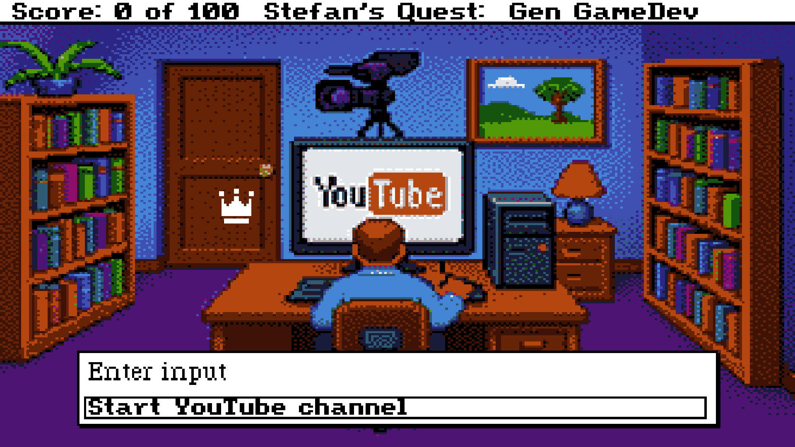
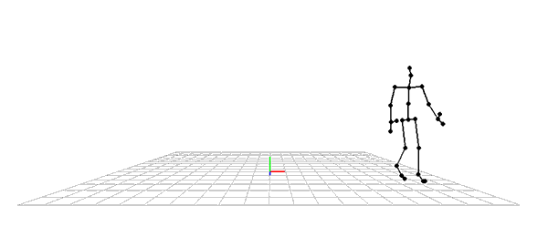
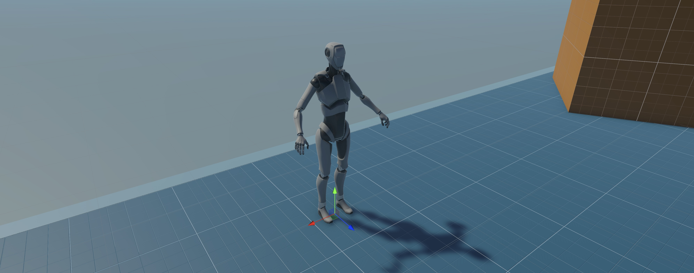

<!-- {: style="width:100%"} -->

Picture a Tomb Raider where Lara Croft just floats stiffly through the ruins instead of vaulting, rolling, and leaping across them. Or a Quake where enemies drift aimlessly, instead of prowling and lunging at you. Animation transforms these static worlds into living ones. After music, I’d argue it’s the most emotionally charged element in games. So the question is—*how do we create animation that truly brings characters to life?*

In this series, I’ll walk through the fundamentals of character animation using Unity, Blender, and a sprinkle of Python. <!-- more -->
A bit of background: I come from an AI research background and now work as a Developer Advocate in the Generative AI space, creating content to inspire others to build with AI. Recently (well, actually, four months ago!), I decided to merge that professional expertise with a personal passion—using Generative AI for game development. My starting point? Human motion synthesis—using AI to generate animations for human characters.

While my foundation in Generative AI was strong, I quickly realized I needed to deepen my understanding of digital animation to make sense of the research papers and code I was exploring. That led me down a rabbit hole of textbooks, Unity forum threads, and scattered documentation. I found YouTube tutorials helpful for quick tips, but they rarely dove into the core concepts behind animation. That gap inspired me to create this short series of blog posts and videos, *A Short Primer on Character Animation*, to cover not just the “how” but also the “why” of bringing characters to life.”

## Articulation: Pinnochio in Digital Form
{: style="width:100%"}

Look again at the puppet in the thumbnail image. Its rigid segments are linked at *joints*, each one responding to the pull or release of strings from the puppeteer’s control bar. With deft movements, the puppeteer can make it walk, bow, or wave—every motion of one joint subtly influencing the next through their connections.

This familiar approach to bringing figures to life is called *articulation*. It works for humans, animals, or even a tree swaying in the wind. In this model, rigid bodies—known as *bones*—are joined together to form a *skeleton*, or, *armature*. The word “articulation” comes from the Latin for “joint,” reflecting the way we rotate and position these bones at their joints to create a *pose*. When we adjust these orientations, we say the character is articulated.

For example, a common model for human characters contains around 21 bones connected at 20 joints (see the skeletal animation above). I say this is a *model* since the real human body contains more than 200 bones and 600 muscles, so what we have here is a useful simplification of reality, i.e., a model. A real human would have over 200 degrees of freedom whereas our model has . Still, it is a totally adequate representation for human animation excepting hands, feet, and faces.

## What's next?
{: style="width:100%"}
So, that's the basics of articulated animation: bones, joints, skeletons, and poses. In the next article, we’ll dive deeper into the technical aspects of articulated motion and animate a character with Unity.